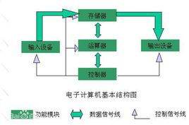

# 1.According to the von Neumann architecture, List basic parts of a computer. 

# 2.A computer has 64 MB (megabytes) of memory. How many bits are needed to address any single byte in memory? 
26
# 3.List basic parts of a CPU, include cache or not? 
CPU包括运算逻辑部件、寄存器部件、控制部件。包含缓存。
# 4.What mean secondary storage. List some on your PC. 
Secondary storage is a non-volatile memory (does not lose stored data when the device is powered down) that is not directly accessible by the CPU.  
SSD,HDD  
# Wikipedia
1 )CPU:  
A central processing unit (CPU) is the electronic circuitry within a computer that carries out the instructions of a computer program by performing the basic arithmetic, logical, control and input/output (I/O) operations specified by the instructions.   
中央处理单元(CPU)是通过执行指令指定的基本算法、逻辑、控制和输入/输出(I/O)操作来执行计算机程序指令的计算机内的电子线路。  
2 )RAM:  
RAM is a form of computer data storage that stores data and machine code currently being used. A random-access memory device allows data items to be read or written in almost the same amount of time irrespective of the physical location of data inside the memory.   
RAM是存储当前正在使用的数据和机器代码的计算机数据存储的一种形式。RAM设备允许在几乎相同的时间内读取或写入数据项，而不管数据在存储器中的物理位置如何。  
3 )ROM:  
Read-only memory (ROM) is a type of non-volatile memory used in computers and other electronic devices. Data stored in ROM can only be modified slowly, with difficulty, or not at all, so it is mainly used to store firmware (software that is closely tied to specific hardware, and unlikely to need frequent updates) or application software in plug-in cartridges.  
只读存储器(ROM)是一种用于计算机和其他电子设备的非易失性存储器.存储在ROM中的数据只能被缓慢、困难地修改，或者根本不能修改，因此它主要用于存储固件(与特定硬件紧密相连的软件，并且不需要频繁更新)或插件盒中的应用软件。  
4 )Bus:  
A Bus is a communication system that transfers data between components inside a computer, or between computers.  
总线是在计算机内部或计算机之间传输数据的通信系统。
5 )Parallel Computing:  
Parallel computing is a type of computation in which many calculations or the execution of processes are carried out simultaneously.  
并行计算是一种同时进行多个计算或进程执行的计算。  
# 6. 
云计算（cloudcomputing）是基于互联网的相关服务的增加、使用和交付模式，通常涉及通过互联网来提供动态易扩展且经常是虚拟化的资源。
# 7.
1 )DDR3是第三代双倍速率同步动态随机存储器，是现在的主流内存规格。
1333是内存分频率。  
2 )不能。  
3 )能，但不显著。  
4 )34  

