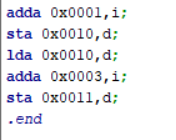
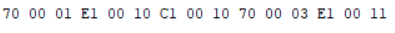
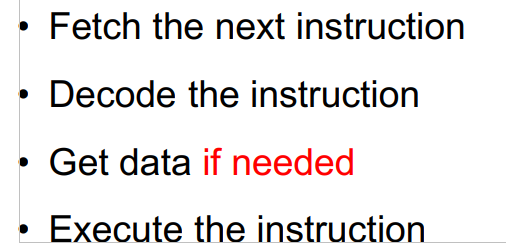
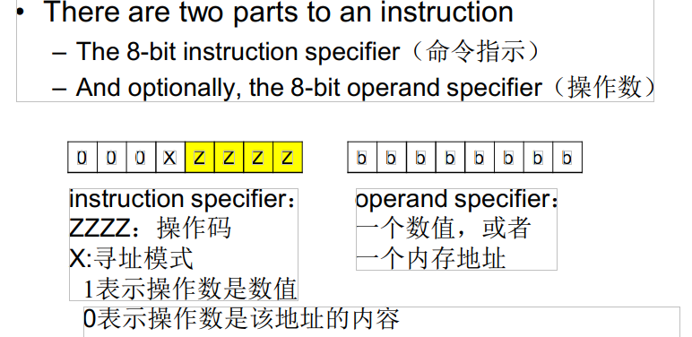

# 1.
1 )  
第一个为汇编码，第二个为机器码(十六进制，懒得化为二进制了)  

  
2 )
>

3 )  
IR:指令寄存器，存放的是正在执行的指令的副本。   
PC:程序计数器，存放的是下一条要执行的指令的地址。   
ACC:累加器（寄存器A），专门用来存放操作数或运算结果。在CPU执行某种运算前，两个操作数中的一个通常应放在累加器A中，运算完成后累加器A中便可得到运算结果。  
4 )  
计算机语言中的var：Pascal: var 在Pascal 作为程序的保留字，用于定义变量。    
在机器中相当于在内存中记录下对应的变量的名a,c（ASCII码），和对应的地址。在对两者做与逻辑运算，预算结果存放在寄存器中，后
# 2.
1 ) data and address  
2 )Yes.They can store in the same place.  
3 )
>
# 3.
1 )Assembly language:
>An assembly (or assembler) language, is any low-level programming language in which there is a very strong correspondence between the program's statements and the architecture's machine code instructions.  

汇编语言，是任何具有这样性质低级编程语言，该性质为其中程序的语句与体系结构的机器代码指令之间有很强的对应关系。  

2 )Compiler:
>A compiler is computer software that primarily translates computer code from a high-level programming language to machine code to create an executable program.

编译器是一种计算机软件，它主要将计算机代码从高级编程语言转换为机器代码，以创建可执行程序。  
3 )Imperative programming:
>Imperative programming is a programming paradigm that uses statements that change a program's state.

命令式语言是一种编程范例，它使用改变程序状态的语句。  
4 )Functional programming:
>Functional programming is a programming paradigm—a style of building the structure and elements of computer programs—that treats computation as the evaluation of mathematical functions and avoids changing-state and mutable data.

函数编程语言是一种编程范式-一种构建计算机程序结构和元素的能够将计算视为数学函数的评估，并避免状态和可变数据的变化的方式。  
5 )Procedural programming:
>Procedural programming is a programming paradigm, derived from structured programming, based upon the concept of the procedure call. 

过程式编程是基于过程调用的概念从结构化编程中派生出来的一种编程范式。