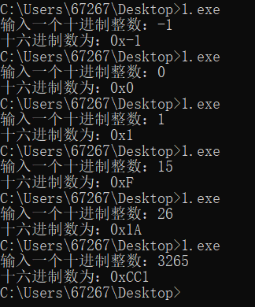

# 1、阅读PseudocodeStandard。（答案可以打印）

1）用伪代码描述将十进制转换成16进制的方法
~~~
procedure dec_to_hex(A)
set i to 0
if A=0
then print"0"
end procedure
if A<0
set A to -A
print"-"
for(A>0)
let s[i] be the reminder of A devides 16 
increment i by 1
set A to integral part of A devides 16
for each element in s[]
print it in the reverse order
end procedure
~~~
2）C语言实现（先用注释写好算法，然后翻译）
~~~c
#include <stdio.h>
int main() 
{ 
int num;
int a[100]; 
int i=0; 
int m=0;
int b; 
char hex[16]={'0','1','2','3','4','5','6','7','8','9','A','B','C','D','E','F'};
printf("输入一个十进制整数："); 
scanf("%d",&num);
printf("十六进制数为：0x"); 
if (num==0)
{
	printf("0");
	return 0;
}
if (num<0)
{
    num=(-num);
    printf("-");
} 
while(num>0) 
{ 
b=num%16; 
a[i]=b;
++i; 
num=num/16; 
} 
for(i=i-1;i>=0;i--)
{ 
m=a[i];
printf("%c",hex[m]); 
}
}
~~~
3）使用-1,  0,  1,  15,   26，3265最为输入测试你的程序

# 2、名词解释与对比

1）Top-down design

>A top-down approach is essentially the breaking down of a system to gain insight into its compositional sub-systems in a reverse engineering fashion.  
自上而下的方法实质上是进行系统分解，以逆向工程的方式深入了解其组成的子系统。

2）Work breakdown structure (WBS)

>A work-breakdown structure (WBS) in project management and systems engineering, is a deliverable-oriented breakdown of a project into smaller components. 
在项目管理和系统工程中，工作分解结构（WBS）是以可交付成果为导向进行分解将项目分解为更小的组件。

3）简述管理学WBS与信息学Top-down设计的异同

同：都是将一个大的事物分解为局部的部分。  
异：top-down自上而下进行进行分解（递进逻辑关系），WBS按类分解（可能是平行关系）。
# 3、仔细观察您洗衣机的运作过程，运用Top-down设计方法和Pseudocode描述洗衣机控制程序。
假设洗衣机可执行的基本操作如下：  
water_in_switch(open_close)  // open打开上水开关，close关闭   water_out_switch(open_close)  // open打开排水开关，close关闭  
get_water_volume()  //返回洗衣机内部水的高度
motor_run(direction) //电机转动。left左转，right右转，stop停  
time_counter()  //返回当前时间计数，以秒为单位  
halt(returncode) //停机，success成功failure失败

1）请使用伪代码分解“正常洗衣”程序的大步骤。包括注水、浸泡等

2）进一步用基本操作、控制语句（IF、FOR、WHILE等）、变量与表达式，写出每个步骤的伪代码

3）根据你的实践，请分析“正常洗衣”与“快速洗衣”在用户目标和程序上的异同。你认为是否存在改进（创新）空间，简单说明你的改进意见？

4）通过步骤3），提取一些共性功能模块（函数），简化“正常洗衣”程序，使程序变得更利于人类理解和修改维护。例如：  
wait(time) //等待指定的时间；  
注水(volume,timeout) //在指定时间内完成注水，否则停机；  
排水(timeout)。等子程序  