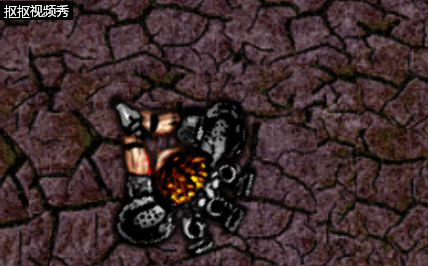

# 前言

你应该有玩过各种游戏，也产生过自己做游戏的想法，但会因为庞大的工程量而败下阵来。不要灰心！一款叫做construct 2（下简称c2）的软件能满足你入门级的做游戏的需求，它操作相较而言比较简便，因而适合小白。

说了这么多，是时候讲用c2制作基本的游戏，通过这个教程，相信你可以独立掌握“飞机大战”的流程。
# 操作步骤
## 新建项目
1.点击屏幕左上角File->New->New empty project  
2.双击画布，此时会弹出以下界面。选择Tiled Background。 
 
3.此时再在画布上点击，弹出以下界面。点开文件夹图标，选择一个背景。  
4.关闭弹出界面。点击画布外侧，将右侧弹出的Layout Size改为1280,1024。  
5.点击选中图片，将其position和size按如图调整。

## 添加更多对象
1.点击屏幕右侧“Layers”进入图层管理系统。  
2.将背景layer1更名为Background并锁定。然后新加入一个层layer2，我们将要在这个层上进行主要的操作，所以把它改名为Main并选中。  
完成后效果如图。
  
3.回到画布中，双击插入“Mouse”“Keyboard”对象。（注意，此步必须插上鼠标操作，不然感应）  
4.现在是时候插入新对象了，我们接下来要插入游戏对象，如玩家，子弹等，共分为五个步骤。  
1、双击插入新对象。   
2、双击选择Sprite对象。   
3、当鼠标变成十字，在画布中点击 。  
4、弹出对话框，点击open 图标，加载四张素材图片中的一张 。  
5、保存并关闭对话框 。  
6.将子弹、爆炸移到画布外，并将对应物体的名字更改。（如由“Sprite”改为“Player”）  
7.现在添加更多的怪物。按住Ctrl，拖拽Monster对象即可复制怪物图像。
## 调整状态

在游戏中，每个图像都需添加对应的状态，这样游戏才能符合一定的逻辑，正常运行。
### 添加行为
先给各个物体添加一定的属性。  
1.点击选中的某物体，在右边弹出界面的“Behavior”分类下点击“add”。
  

2.在弹出界面中点击绿色加号，双击“8 Direction”，便完成了一个行为的添加。
   
3.用同样的方法分别给“Player”、“Bullet”、“Monster”、“Explosion”对象添加如下行为。  
1、给player添加Scroll To和Bound to layout行为。    
2、给Bullet对象添加Bullet movement和Destroy outside layout行为。   
3、给Monster对象添加Bullet movement行为。   
4、给Explosion对象添加Fade行为。  
### 进行微调
我们先调整各物体的状态，点击选中的某物体在弹出的右侧可以调整其状态，如调整“speed”等。  
更改speed速度为80。用同样的方法给Bullet子弹对象的速度更改为400，Explosion对象的Fade行为的Fade out time淡出时间为0.5秒。
## 添加事件
事件实际上是一种函数，起着如判断，选择之类的重要作用。这也是一个游戏制作最重要的一步。
下面我们来演示添加第一个事件。

1.在画布上方选项卡处将“layout1”切换至“event sheet1”，进入另一界面。  
2.在空白处双击，打开添加事件对话框。  
3.选择system->next->every tick->done。此步完成了添加对象。
  
4.现在添加“action”。双击对象后的“add action”，进入新界面。  
5.选择player->next->Set angle towards position->done，在弹出新界面中分别指定x，y为“MouseX”“MouseY”。点击“done”。  
这样，第一个事件就添加完毕。

下面，如法炮制，添加以下一系列事件。全部添加完成后效果如下。
.png)

# 试玩
以下为试玩效果，虽然十分粗糙，但好歹是自己完成的游戏，很有成就感。

  
