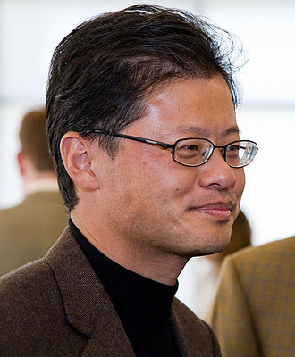
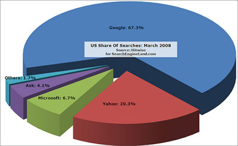

# 前言
&emsp; &emsp; 提到IT行业，我相信不少人对一些人的名字耳熟能详，如乔布斯，比尔盖茨等等。而我今天将要介绍另一个人物，他的名字叫做杨致远。
# 基本信息
&emsp; &emsp; 杨致远（英文名：Jerry Yang），于1968年11月08日生于台湾，全球知名互联网公司雅虎（Yahoo!）的创始人，原首席执行官。他祖籍湖北，毕业于斯坦福大学，最主要的成就便是创立了Yahoo！。

# 人生经历
## 早年
&emsp; &emsp; 杨致远于1968年11月8日生于台湾，其母是一个英语和戏剧教授，其父在其两岁的时候去世，他和弟弟由母亲抚养长大。1978年，杨致远全家搬迁到San Jose，California杨致远于1990年以优异的成绩进入斯坦福大学。
## 大学
&emsp; &emsp; 杨致远在大学选了修电机工程的专业，他天赋异禀，仅花了四年就拿到了学士，硕士的学位。他于1989年在斯坦福认识了大卫·费罗。他俩于1992年去日本参加为期六个月的交流活动，杨致远在那里遇到了他后来的妻子山崎明子。
## 职业生涯
### 创立Yahoo！
&emsp; &emsp; 1994年在斯坦福大学读书时，杨和大卫·费罗共同创建一个网站，其名为“Jerry and David‘s Guide to the World Wide Web”。该网站用字典的形式罗列了其他的网站。随着网站越来越受欢迎，他们把网站改名为“雅虎公司”。同时因为访问量过大，出现了把学校网络挤瘫痪的情况。他被学校劝退。他因此辍学，并专心于创业。
### 稳步发展
&emsp; &emsp; 1996年第二季度末，每天已经有200万网民造访雅虎，累计每天1400万次。其中有75%是回头客。但杨致远并不满足于仅仅拥有一个可以吸引回头客的品牌。他说，“如果我们是个软件工具公司，就会被微软挤垮，如果我们是一个出版物，就像《时代》周刊一样有一批忠实的读者，那么就会长期发展下去。”  
&emsp; &emsp; 1996年第一季度，雅虎与竞争对手Infoseek、Excite、Lycos相比，每天的访问量就超过对手的两倍。1997年年底，日均访问量达到9000多万人次，比所有对手访问量的总和还要多。连Infoseek的老板也不得不承认，雅虎已超越其他对手。的确，雅虎已今非昔比：公司有不少令人敬仰的管理人才，有一套完整的营销策略，最重要的是还有1亿美元的现金。一位分析家说：“雅虎在很多方面都已经领先同行，把它与其他的搜索引擎相提并论是不恰当的。”  
&emsp; &emsp; 1997年，雅虎收入6700万美元，亏损2300万美元。从账面上看，这完全是一个失败的公司。但是在互联网上，它却是最大的明星。市场价值超过网景，升至28亿美元。1997年第三季度，雅虎的市场价值首次超过浏览器大王网景。
### 达到鼎盛        

&emsp; &emsp; 1998上半年 ，每个月至少有3000万用户访问 Yahoo!, 每天浏览下载量达到1亿页！  
&emsp; &emsp; 1998年《福布斯》杂志推出高科技百名富翁，杨致远以10亿美元的财富跃居第16位，超过了冠群CEO王嘉廉，成为高科技中的华人首富。  
&emsp; &emsp; 1999年4月，形式净收入为2,510万美元，收入为8,610万美元。公司仍然保持强势增长。  
&emsp; &emsp; 1999年，杨致远和费罗已成为网络媒体公司的舵手，公司市场价值高达390亿美元，而杨致远的纸面财富达到75亿美元。  
&emsp; &emsp; 浏览量从1998年12月份的平均每日1.67亿增加到2.35亿，增幅达41%，同时注册用户数量从3,500万人增加到4,700万人。2月份用户增长率是前十名网站中最好的，并且是整个网络平均增长率的两倍。
### 错失机会
#### 谷歌
&emsp; &emsp; 很久之前之前谷歌还只是拉里.佩奇在斯坦福大学创办的一个名叫“BackRub(网络爬虫)”的研究项目，据尼古拉斯.卡尔森的著作《拯救雅虎：玛丽莎.梅耶尔传》记载，当时的拉里.佩奇想要以100万美元卖掉它，以继续自己的博士学业，然后当一名教授。为此，拉里.佩奇找到雅虎创始人杨致远与戴维·费罗，表达了自己想出售“BackRub”项目的意愿，但是雅虎方面并没有收购的意思。  
&emsp; &emsp; 而2000年雅虎的市值就已经达到1280亿美元，比上一年增长了1050亿。但此时的雅虎只有6个人做搜索业务。为了拓展搜索业务，雅虎决定与谷歌合作，雅虎付钱给谷歌，谷歌为雅虎提供搜索服务。  
&emsp; &emsp; 据《拯救雅虎：玛丽莎.梅耶尔传》记载，在雅虎和谷歌达成这个合作意向之前，谷歌的销售负责人辛迪.麦卡弗里打电话给雅虎的业务人员，希望雅虎创始人戴维.费罗和杨致远到谷歌露个面，发表一个讲话。然而，接电话的女士被上司告知，要坚定地拒绝麦卡弗里的要求。  
&emsp; &emsp; 雅虎又一次拒绝了谷歌。在这次拒绝后，谷歌走上的快速发展的轨迹。2000年9月12日，Google宣布在Google.com增加简体及繁体两种中文版本，开始为全球中文用户提供搜索服务。2001年9月，Google的网页评级机制PageRank被授予了美国专利。
后来，雅虎被谷歌赶上并超过。  

#### Facebook
&emsp; &emsp; Yahoo在2006年，也曾错过并购Facebook。  
&emsp; &emsp; 当时Yahoo希望以10亿美元收购Facebook，不过扎克伯格拒绝了，Facebook董事会，有意把售价提高至11亿美元，再逼扎克伯格点头出售，但这次换塞梅尔不愿接受抬价，机会又再度错失。而Facebook的市值，也在今年3月突破4000亿美元。
#### 微软收购
&emsp; &emsp;错失了诸多机会后，雅虎渐渐被当年的竞争对手甚至收购对象赶上超过2008年时雅虎已不复八年前的荣光。   
&emsp; &emsp; 二零零八年二月，微软主动提出用446亿美元收购雅虎用446亿美元；当时的雅虎仍在努力追赶谷歌，而微软仍在寻求互联网战略。这一出价比雅虎当时的市场价值高出62%！。谈判很艰难，因为杨致远不想出售雅虎也不愿提出还价。谈判在2008年5月以失败告终，雅虎股价暴跌。杨致远和董事会主席罗伊博斯托克(Roybostock)因谈判而受到投资者的强烈批评，随后引发了多起股东诉讼。
### 后续行动
&emsp; &emsp; 2008年11月18日，雅虎董事会周一宣布，将为公司寻求一名新首席执行官(CEO)；在找到合适人选后，雅虎联合创始人、现任CEO杨致远将辞去其当前职位，但仍将留任公司董事会成员。   
&emsp; &emsp; 2012年1月18日，杨致远辞去雅虎董事会董事、雅虎日本董事会董事、阿里巴巴集团董事会董事职位。为雅虎从私募股权公司引入资金，或是出售持有的40%阿里巴巴集团股份的大部分，从而释放股东价值铺平了道路。  
&emsp; &emsp; 2013年2月23日，联想集团委任雅虎创办人及前首席执行官杨致远为董事会观察员。  
&emsp; &emsp; 2014年11月6日，进入联想董事会，担任独立非执行董事，将不再担任联想董事会观察员。    
2015年12月8日，杨致远出任滴滴快的董事会观察员和公司高级顾问。
# 个人轶事
## 1
&emsp; &emsp; 在斯坦福大学，熟悉杨致远的人认为杨学习不算勤奋，甚至还有点懒，但思想活跃，善于交际，是大学社团的领袖，训练了他日后作为企业领导者的组织才能。
## 2
&emsp; &emsp; 杨致远和费罗是旧识。费罗1988年毕业于杜兰大学，而且一度担任辅导杨致远的助教。一向全拿“A”的杨致远在费罗的判官笔下却居然只得了“B”，对此杨致远至今还发牢骚。后来两人同班听课，还在作业方面开展合作。以此为起点，两人成了最佳搭档。
## 3
&emsp; &emsp; 杨致远热衷于慈善事业，以下是几个关于他进行慈善事业的报道：  
&emsp; &emsp; 2007年2月，杨致远和他的妻子捐出7500万美元给他们的母校斯坦福大学，其中5000万美元用于建造“JerryYang和AkikoYamazaki环境和能源大楼”，这是一座跨学科的研究、教学和实验大楼，该楼设计遵循可持续建筑原则。  
&emsp; &emsp; 在2012年底和2013年初，旧金山亚洲美术馆展示了杨和他妻子的中国书法的收藏品。他于20世纪90年代末开始收藏这批作品。这些选品也大都会出现在2014年的展览“Out of Character: Decoding Chinese Calligraphy”上。  
&emsp; &emsp; 2017年9月，杨致远和妻子承诺向亚洲美术馆博物馆进行捐赠，这是该馆历史上最大的一次捐赠。
# 个人评价
&emsp; &emsp; 尽管杨致远在后来经历了诸多失败，甚至拱手让出了雅虎。但他的经历对于我们而言还是有不少积极价值的：他是最早追随互联网大潮的一批人，也是最早在这个领域成功的一批人。他曾经是华人领袖级的任务，也曾将自己一手创立的公司带往巅峰。他作为最早的“互联网教父”级别的存在，一直在激励着中国一代又一代互联网人奋勇向前。

