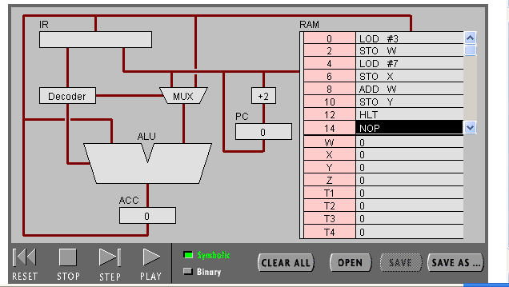
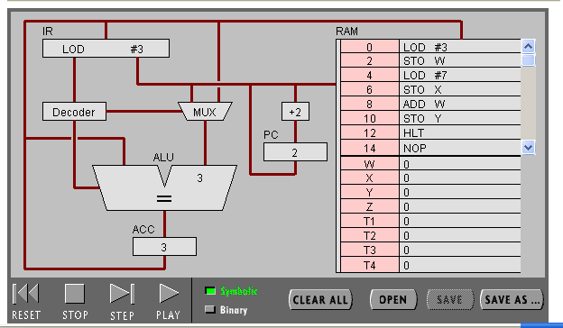
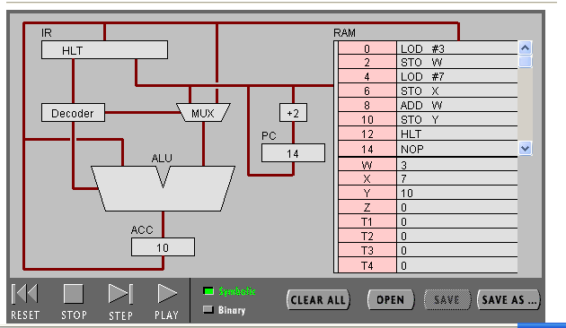
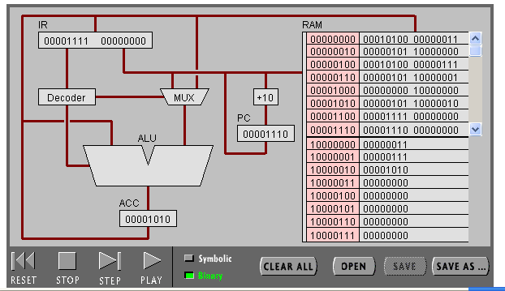
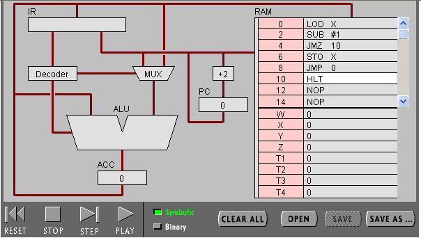
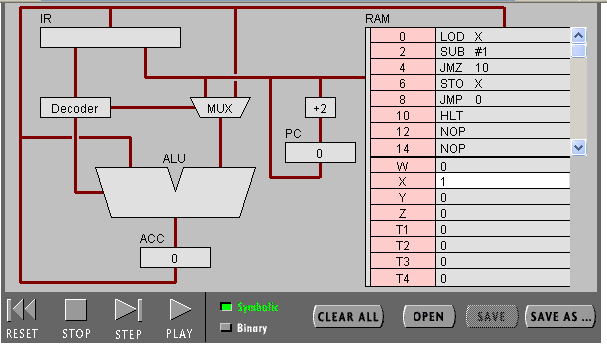
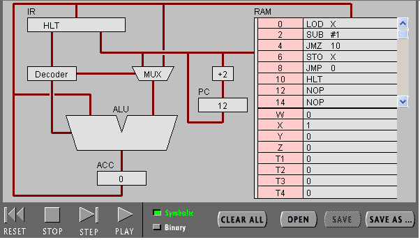
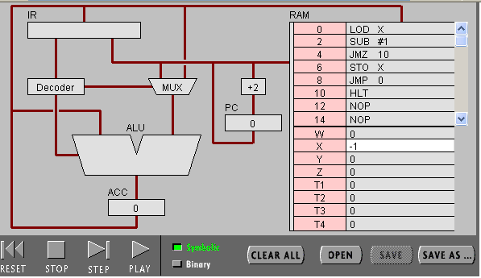
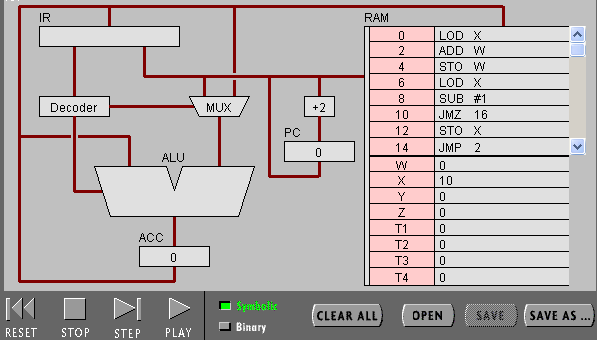
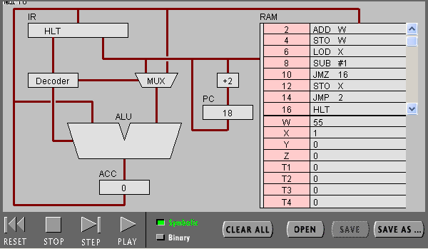

#    PIPPIN实验报告           
~~~
                        姓名:王晟 
                        学号:18342093
~~~
## 目录
- 实验目标
- 实验步骤
- 实验结果
    - 任务1
    - 任务2
- 实验小结

## 实验目标
* 理解冯·诺伊曼计算机的结构
* 理解机器指令的构成
* 理解机器指令执行周期
* 用汇编编写简单程序

## 实验步骤
### 任务1


* 打开网页输入程序的代码

* 点击step一步步执行程序

* 最终程序结束运行时的状况

* 点击“Binary”，查看代码情况

### 任务2


* 打开网页输入程序的代码

* 给x赋予1的值，执行程序

运行结果

给x赋予-1的值，执行程序

最后PIPPIN会因溢出而报错
* 修改后的程序

最后一项为  16   HLT  

* 运行结果


## 实验结果

### 任务1:简单程序

(2)   
1.

IR:指令寄存器，存放的是正在执行的指令的副本。   
PC:程序计数器，存放的是下一条要执行的指令的地址。  
2.

Accumulator;累加器（寄存器A），专门用来存放操作数或运算结果。在CPU执行某种运算前，两个操作数中的一个通常应放在累加器A中，运算完成后累加器A中便可得到运算结果。  
3.

PC从RAM读取地址对应指令（LOD　＃３）-->IR载入并寄存指令-->Decoder对指令进行解码编译，将LOD指令传给ALU-->同时给MUX以指令使得３经过MUX传入ALU-->ALU运算得到结果３，并传入ACC中-->PC中数值自加２-->准备进行下一轮操作。  
4.

PC从RAM读取地址对应指令（ADD　W）-->IR载入并寄存指令-->Decoder对指令进行解码编译，将LOD指令传给ALU，并命令ACC将值传进ALU-->同时给MUX以指令使得W中的数值经由MUX传给ALU-->ALU进行全加器加法运算并将值传入ACC-->PC中数值自加２-->准备进行下一轮操作。  
5.

ALU进行的运算不同；以及ADD W需从ACC及W对应地址中调取值到ALU中。     
(3)    
1.

00010100 00000111；  
从左往右数最开始三位表示寻址模式：立即寻址，后面的一位“1”表示后面的操作数代表数值而非地址，在后面四位“0100”表示LOD指令；后面八位（下一字节）为数字7的二进制表示。  
2.

共八位，表示一个0~255（或-128~127）的数，每一个地址和相应指令对应，计算时检验地址读取对应指令。  
3.

8位。  
4.
~~~
int_8 w=3;  
int_8 x=7;  
int_8 z=x+w;
~~~
以上为c代码
### 任务2：简单循环
(1)  
1.

不断将x的值减1，直至减到0为止（x不小于1时）；x不大于0时，一直将x减1直至-128。  
2.
```c
# include<stdio.h>
int main(){
    int x;
    scanf("%d",&x);
    while(x>=1&&x!=0) --x;
    while(x<=0&&x>=-128) --x;
    return x;
}
```   

(2)  
1.
```c
# include<stdio.h>
int main(){
    int x;
    scanf("%d",&x);
    for(int w = 0;x != 0;--x)
        w = w + x;
    return w;
}
```    
以上为c代码  
2.

最后一项为  16   HLT   
3.

联系：高级语言每条语句往往等价于机器语言多条语句，是后者经过归纳精简开发出来的。  
区别：机器语言往往直接作用于硬件结构,且不同机器的实现形式不同；而高级语言虽不能直接作用于硬件，但其具备的可以执行,使其使用起来更便利及更有利于推广。
## 实验小结
通过pippin实验，我更加深入的了解了冯.诺依曼体系结构，以及CPU各组件的具体功能，并了解了运算如何通过线路得以实现。我同时了解了Fetch→Decode→Execute循环的过程。通过以上简单的知识，我成功掌握了一些简单程序的编写。总的来说，这次实验加深了我对计算机硬件结构(尤其是CPU)运作原理的了解。