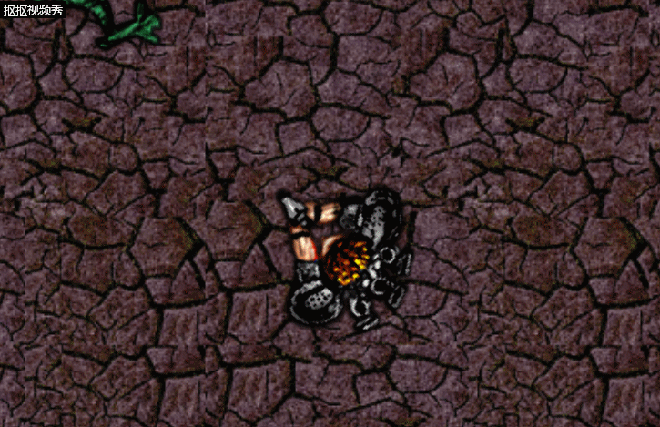
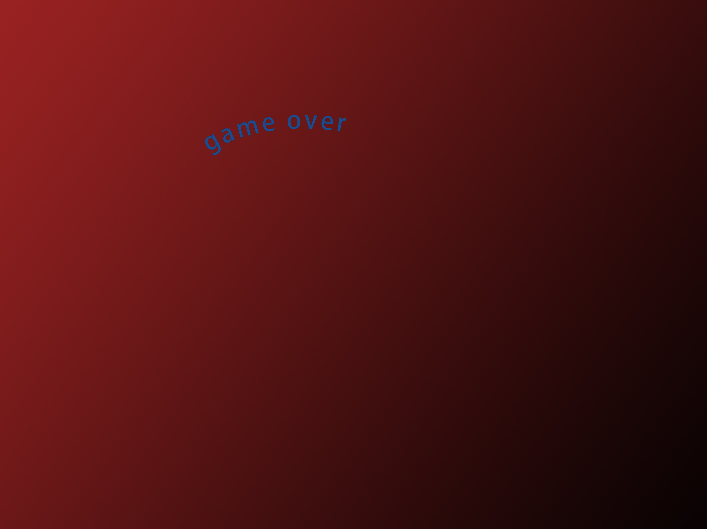
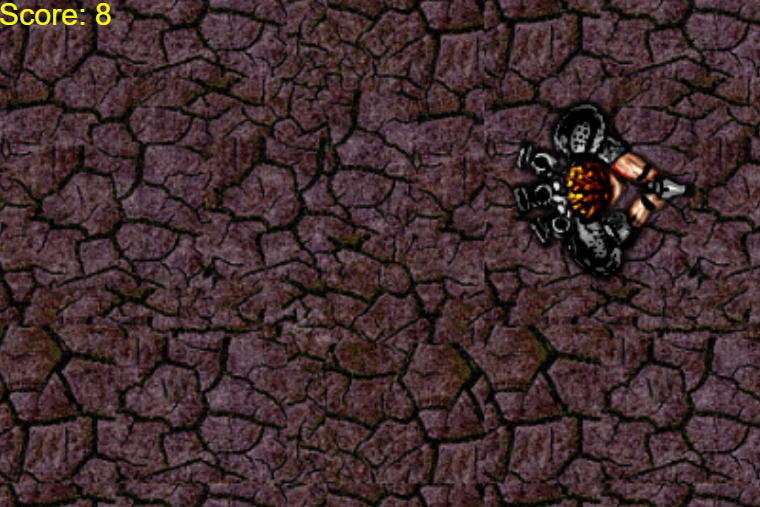
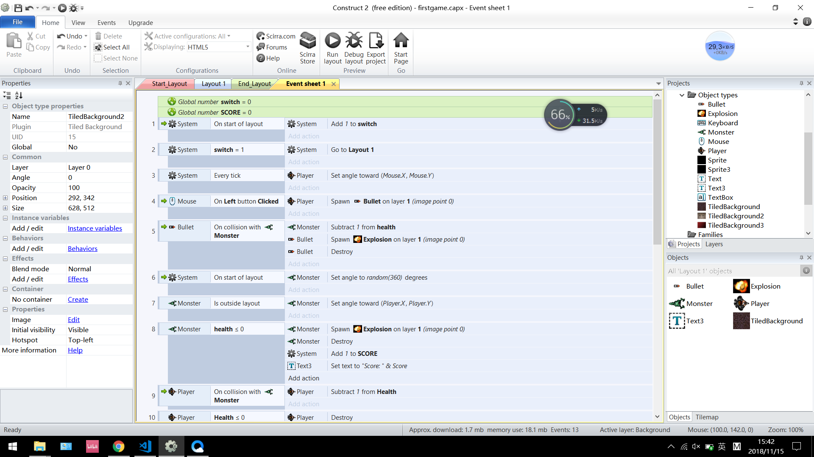

# 进阶级游戏设计
## 前言
在之前[第一次](lab02)做游戏后，这次进阶篇主要要求的是游戏的策划环节，同时添加一些面向对象的成分。我们都知道，在现实的游戏设计中一个游戏如果空有游戏性(当然我这个连游戏性都没有)，而没有优秀的故事背景、操作界面等内容，也不可能让玩家产生带入感，从而吸引玩家。  
所以，这次要做的就是游戏策划和小结,从而简单了解游戏开发的基本步骤。
## 游戏策划
### 游戏名称
太空大战
### 游戏人数
游戏类型
### 游戏类型
二维射击
### 故事背景
8102年，人类的科技由于遭到三体人(智子)已经停滞不前。虽然智子时刻在监视并限制人类各种活动，但人类还是通过现有技术造出了电磁炮等强大武器；而另一边三体虽没遭遇技术封锁，但它们由于自我生存环境恶劣(身处的三星系统生存条件逐渐恶劣)，且结束了其技术爆炸期，技术也发展缓慢。这样，人类就和三体人有了竞争的资本。人类，在三体舰队某次巡逻时设下埋伏，并发动了大规模战争。而游戏便是描绘的战争中某个局部战斗的场景。
### 游戏玩法
你操控着飞船，按方向键移动并按鼠标射击异状物体(就是三体人)，小心被敌人碰到导致扣血。
### 其他
游戏拥有所谓的记分板，且游戏拥有简单的计分器。
## 编程
用截图的形式展现




## 游戏小结(CRC卡片法)
关于CRC卡片：下为示例。
```
+---------------------------------+     
| Object Name                     |  
+---------------------------------+
| Attributes                      |
+--------------+------------------+
| Collaborator | Events & Actions |
+--------------+------------------+
|              |                  |
+--------------+------------------+
```
这里其实就是将lab02中的“事件”机制用一种类似表格的形式展现出来，下面我们粗略运用这一方法。

|Collaborator|Object Name|Attributes|Events & Actions|
|-|-|-|-|
|~|Bullet|shoot when mouse click|~|
|~|Monster|move randomly|destroy when bullets hit it|
|~|Player|move through arrow keys|~|
|~|Scoreboard|follow the player|increment by 1 when a monster destroy|